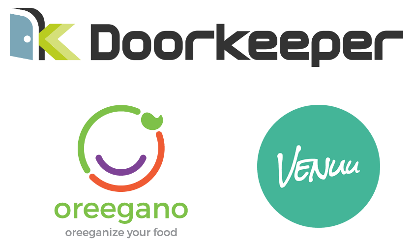

Mobility
========

[][gem]
[][actions]
[][codeclimate]
[](https://gitter.im/mobility-ruby/mobility)

[gem]: https://rubygems.org/gems/mobility
[actions]: https://github.com/shioyama/mobility/actions
[codeclimate]: https://codeclimate.com/github/shioyama/mobility
[docs]: http://www.rubydoc.info/gems/mobility
[wiki]: https://github.com/shioyama/mobility/wiki

**This is the readme for version 1.x of Mobility. If you are using an earlier
version (0.8.x or earlier), you probably want the readme on the [0-8
branch](https://github.com/shioyama/mobility/tree/0-8).**

Mobility is a gem for storing and retrieving translations as attributes on a
class. These translations could be the content of blog posts, captions on
images, tags on bookmarks, or anything else you might want to store in
different languages. For examples of what Mobility can do, see the
<a href="#companies-using-mobility">Companies using Mobility</a> section below.

Storage of translations is handled by customizable "backends" which encapsulate
different storage strategies. The default way to store translations
is to put them all in a set of two shared tables, but many alternatives are
also supported, including [translatable
columns](http://dejimata.com/2017/3/3/translating-with-mobility#strategy-1) and
[model translation
tables](http://dejimata.com/2017/3/3/translating-with-mobility#strategy-2), as
well as database-specific storage solutions such as
[json/jsonb](https://www.postgresql.org/docs/current/static/datatype-json.html) and
[Hstore](https://www.postgresql.org/docs/current/static/hstore.html) (for
PostgreSQL).

Mobility is a cross-platform solution, currently supporting both
[ActiveRecord](http://api.rubyonrails.org/classes/ActiveRecord/Base.html)
and [Sequel](http://sequel.jeremyevans.net/) ORM, with support for other
platforms planned.

For a detailed introduction to Mobility, see [Translating with
Mobility](http://dejimata.com/2017/3/3/translating-with-mobility). See also my
talk at RubyConf 2018, [Building Generic
Software](https://www.youtube.com/watch?v=RZkemV_-__A), where I explain the
thinking behind Mobility's design.

If you're coming from Globalize, be sure to also read the [Migrating from
Globalize](https://github.com/shioyama/mobility/wiki/Migrating-from-Globalize)
section of the wiki.

Installation
------------

Add this line to your application's Gemfile:

```ruby
gem 'mobility', '~> 1.1.1'
```

### ActiveRecord (Rails)

Requirements:
- ActiveRecord >= 5.0 (including 6.x)

(Support for most backends and features is also supported with
ActiveRecord/Rails 4.2, but there are some tests still failing. To see exactly
what might not work, check pending specs in Rails 4.2 builds.)

To translate attributes on a model, extend `Mobility`, then call `translates`
passing in one or more attributes as well as a hash of options (see below).

If using Mobility in a Rails project, you can run the generator to create an
initializer and a migration to create shared translation tables for the
default `KeyValue` backend:

```
rails generate mobility:install
```

(If you do not plan to use the default backend, you may want to use
the `--without_tables` option here to skip the migration generation.)

The generator will create an initializer file `config/initializers/mobility.rb`
which looks something like this:

```ruby
Mobility.configure do

  # PLUGINS
  plugins do
    backend :key_value

    active_record

    reader
    writer

    # ...
  end
end
```

Each method call inside the block passed to `plugins` declares a plugin, along
with an optional default. To use a different default backend, you can
change the default passed to the `backend` plugin, like this:

```diff
 Mobility.configure do

   # PLUGINS
   plugins do
-    backend :key_value
+    backend :table
```

See other possible backends in the [backends section](#backends).

You can also set defaults for backend-specific options. Below, we set the
default `type` option for the KeyValue backend to `:string`.

```diff
 Mobility.configure do

   # PLUGINS
   plugins do
-    backend :key_value
+    backend :key_value, type: :string
   end
 end
```

We will assume the configuration above in the examples that follow.

See [Getting Started](#quickstart) to get started translating your models.

### Sequel

Requirements:
- Sequel >= 4.0

When configuring Mobility, ensure that you include the `sequel` plugin:

```diff
 plugins do
   backend :key_value

-    active_record
+    sequel
```

You can extend `Mobility` just like in ActiveRecord, or you can use the
`mobility` plugin, which does the same thing:

```ruby
class Word < ::Sequel::Model
  plugin :mobility
  translates :name, :meaning
end
```

Otherwise everything is (almost) identical to AR, with the exception that there
is no equivalent to a Rails generator, so you will need to create the migration
for any translation table(s) yourself, using Rails generators as a reference.

The models in examples below all inherit from `ApplicationRecord`, but
everything works exactly the same if the parent class is `Sequel::Model`.

Usage
-----

### <a name="quickstart"></a>Getting Started

Once the install generator has been run to generate translation tables, using
Mobility is as easy as adding a few lines to any class you want to translate.
Simply pass one or more attribute names to the `translates` method with a hash
of options, like this:

```ruby
class Word < ApplicationRecord
  extend Mobility
  translates :name, :meaning
end
```

Note: When using the KeyValue backend, use the options hash to pass each attribute's type:

```ruby
class Word < ApplicationRecord
  extend Mobility
  translates :name,    type: :string
  translates :meaning, type: :text
end
```

This is important because this is how Mobility knows to which of the [two translation tables](https://github.com/shioyama/mobility/wiki/KeyValue-Backend) it should save your translation.

You now have translated attributes `name` and `meaning` on the model `Word`.
You can set their values like you would any other attribute:

```ruby
word = Word.new
word.name = "mobility"
word.meaning = "(noun): quality of being changeable, adaptable or versatile"
word.name
#=> "mobility"
word.meaning
#=> "(noun): quality of being changeable, adaptable or versatile"
word.save
word = Word.first
word.name
#=> "mobility"
word.meaning
#=> "(noun): quality of being changeable, adaptable or versatile"
```

Presence methods are also supported:

```ruby
word.name?
#=> true
word.name = nil
word.name?
#=> false
word.name = ""
word.name?
#=> false
```

What's different here is that the value of these attributes changes with the
value of `I18n.locale`:

```ruby
I18n.locale = :ja
word.name
#=> nil
word.meaning
#=> nil
```

The `name` and `meaning` of this word are not defined in any locale except
English. Let's define them in Japanese and save the model:

```ruby
word.name = "モビリティ"
word.meaning = "(名詞):動きやすさ、可動性"
word.name
#=> "モビリティ"
word.meaning
#=> "(名詞):動きやすさ、可動性"
word.save
```

Now our word has names and meanings in two different languages:

```ruby
word = Word.first
I18n.locale = :en
word.name
#=> "mobility"
word.meaning
#=> "(noun): quality of being changeable, adaptable or versatile"
I18n.locale = :ja
word.name
#=> "モビリティ"
word.meaning
#=> "(名詞):動きやすさ、可動性"
```

Internally, Mobility is mapping the values in different locales to storage
locations, usually database columns. By default these values are stored as keys
(attribute names) and values (attribute translations) on a set of translation
tables, one for strings and one for text columns, but this can be easily
changed and/or customized (see the [Backends](#backends) section below).

### <a name="getset"></a> Getting and Setting Translations

The easiest way to get or set a translation is to use the getter and setter
methods described above (`word.name` and `word.name=`), enabled by including
the `reader` and `writer` plugins.

You may also want to access the value of an attribute in a specific locale,
independent of the current value of `I18n.locale` (or `Mobility.locale`). There
are a few ways to do this.

The first way is to define locale-specific methods, one for each locale you
want to access directly on a given attribute. These are called "locale
accessors" in Mobility, and can be enabled by including the `locale_accessors`
plugin, with a default set of accessors:

```diff
 plugins do
   # ...
+  locale_accessors [:en, :ja]
```

You can also override this default from `translates` in any model:

```ruby
class Word < ApplicationRecord
  extend Mobility
  translates :name, locale_accessors: [:en, :ja]
end
```

Since we have enabled locale accessors for English and Japanese, we can access
translations for these locales with `name_en` and `name_ja`:

```ruby
word.name_en
#=> "mobility"
word.name_ja
#=> "モビリティ"
word.name_en = "foo"
word.name
#=> "foo"
```

Other locales, however, will not work:

```ruby
word.name_ru
#=> NoMethodError: undefined method `name_ru' for #<Word id: ... >
```

With no plugin option (or a default of `true`), Mobility generates methods for
all locales in `I18n.available_locales` at the time the model is first loaded.

An alternative to using the `locale_accessors` plugin is to use the
`fallthrough_accessors` plugin. This uses Ruby's
[`method_missing`](http://apidock.com/ruby/BasicObject/method_missing) method
to implicitly define the same methods as above, but supporting any locale
without any method definitions. (Locale accessors and fallthrough locales can
be used together without conflict, with locale accessors taking precedence if
defined for a given locale.)

Ensure the plugin is enabled:

```diff
 plugins do
   # ...
+  fallthrough_accessors
```

... then we can access any locale we want, without specifying them upfront:

```ruby
word = Word.new
word.name_fr = "mobilité"
word.name_fr
#=> "mobilité"
word.name_ja = "モビリティ"
word.name_ja
#=> "モビリティ"
```

(Note however that Mobility will complain if you have
`I18n.enforce_available_locales` set to `true` and you try accessing a locale
not present in `I18n.available_locales`; set it to `false` if you want to allow
*any* locale.)

Another way to fetch values in a locale is to pass the `locale` option to the
getter method, like this:

```ruby
word.name(locale: :en)
#=> "mobility"
word.name(locale: :fr)
#=> "mobilité"
```

Note that setting the locale this way will pass an option `locale: true` to the
backend and all plugins. Plugins may use this option to change their behavior
(passing the locale explicitly this way, for example, disables
[fallbacks](#fallbacks), see below for details).

You can also *set* the value of an attribute this way; however, since the
`word.name = <value>` syntax does not accept any options, the only way to do this is to
use `send` (this is included mostly for consistency):

```ruby
word.send(:name=, "mobiliteit", locale: :nl)
word.name_nl
#=> "mobiliteit"
```

Yet another way to get and set translated attributes is to call `read` and
`write` on the storage backend, which can be accessed using the method
`<attribute>_backend`. Without worrying too much about the details of
how this works for now, the syntax for doing this is simple:

```ruby
word.name_backend.read(:en)
#=> "mobility"
word.name_backend.read(:nl)
#=> "mobiliteit"
word.name_backend.write(:en, "foo")
word.name_backend.read(:en)
#=> "foo"
```

Internally, all methods for accessing translated attributes ultimately end up
reading and writing from the backend instance this way.  (The `write` methods
do not call underlying backend's methods to persist the change. This is up to
the user, so e.g. with ActiveRecord you should call `save` write the changes to
the database).

Note that accessor methods are defined in an included module, so you can wrap
reads or writes in custom logic:

```ruby
class Post < ApplicationRecord
  extend Mobility
  translates :title

  def title(*)
    super.reverse
  end
end
```

### Setting the Locale

It may not always be desirable to use `I18n.locale` to set the locale for
content translations. For example, a user whose interface is in English
(`I18n.locale` is `:en`) may want to see content in Japanese. If you use
`I18n.locale` exclusively for the locale, you will have a hard time showing
stored translations in one language while showing the interface in another
language.

For these cases, Mobility also has its own locale, which defaults to
`I18n.locale` but can be set independently:

```ruby
I18n.locale = :en
Mobility.locale              #=> :en
Mobility.locale = :fr
Mobility.locale              #=> :fr
I18n.locale                  #=> :en
```

To set the Mobility locale in a block, you can use `Mobility.with_locale` (like
`I18n.with_locale`):

```ruby
Mobility.locale = :en
Mobility.with_locale(:ja) do
  Mobility.locale            #=> :ja
end
Mobility.locale              #=> :en
```

Mobility uses [RequestStore](https://github.com/steveklabnik/request_store) to
reset these global variables after every request, so you don't need to worry
about thread safety. If you're not using Rails, consult RequestStore's
[README](https://github.com/steveklabnik/request_store#no-rails-no-problem) for
details on how to configure it for your use case.

### <a name="fallbacks"></a>Fallbacks

Mobility offers basic support for translation fallbacks. First, enable the
`fallbacks` plugin:

```diff
 plugins do
   # ...
+  fallbacks
+  locale_accessors
```

Fallbacks will require `fallthrough_accessors` to handle methods like
`title_en`, which are used to track changes. For performance reasons it's
generally best to also enable the `locale_accessors` plugin as shown above.

Now pass a hash with fallbacks for each locale as an option when defining
translated attributes on a class:

```ruby
class Word < ApplicationRecord
  extend Mobility
  translates :name,    fallbacks: { de: :ja, fr: :ja }
  translates :meaning, fallbacks: { de: :ja, fr: :ja }
end
```

Internally, Mobility assigns the fallbacks hash to an instance of
`I18n::Locale::Fallbacks.new`.

By setting fallbacks for German and French to Japanese, values will fall
through to the Japanese value if none is present for either of these locales,
but not for other locales:

```ruby
Mobility.locale = :ja
word = Word.create(name: "モビリティ", meaning: "(名詞):動きやすさ、可動性")
Mobility.locale = :de
word.name
#=> "モビリティ"
word.meaning
#=> "(名詞):動きやすさ、可動性"
Mobility.locale = :fr
word.name
#=> "モビリティ"
word.meaning
#=> "(名詞):動きやすさ、可動性"
Mobility.locale = :ru
word.name
#=> nil
word.meaning
#=> nil
```

You can optionally disable fallbacks to get the real value for a given locale
(for example, to check if a value in a particular locale is set or not) by
passing `fallback: false` (*singular*, not plural) to the getter method:

```ruby
Mobility.locale = :de
word.meaning(fallback: false)
#=> nil
Mobility.locale = :fr
word.meaning(fallback: false)
#=> nil
Mobility.locale = :ja
word.meaning(fallback: false)
#=> "(名詞):動きやすさ、可動性"
```

You can also set the fallback locales for a single read by passing one or more
locales:

```ruby
Mobility.with_locale(:fr) do
  word.meaning = "(nf): aptitude à bouger, à se déplacer, à changer, à évoluer"
end
word.save
Mobility.locale = :de
word.meaning(fallback: false)
#=> nil
word.meaning(fallback: :fr)
#=> "(nf): aptitude à bouger, à se déplacer, à changer, à évoluer"
word.meaning(fallback: [:ja, :fr])
#=> "(名詞):動きやすさ、可動性"
```

Also note that passing a `locale` option into an attribute reader or writer, or
using [locale accessors or fallthrough accessors](#getset) to get or set
any attribute value, will disable fallbacks (just like `fallback: false`).
(This will take precedence over any value of the `fallback` option.)

Continuing from the last example:

```ruby
word.meaning(locale: :de)
#=> nil
word.meaning_de
#=> nil
Mobility.with_locale(:de) { word.meaning }
#=> "(名詞):動きやすさ、可動性"
```

For more details, see the [API documentation on
fallbacks](http://www.rubydoc.info/gems/mobility/Mobility/Plugins/Fallbacks)
and [this article on I18n
fallbacks](https://github.com/svenfuchs/i18n/wiki/Fallbacks).

### <a name="default"></a>Default values

Another option is to assign a default value, using the `default` plugin:

```diff
 plugins do
   # ...
+  default 'foo'
```

Here we've set a "default default" of `'foo'`, which will be returned if a fetch would
otherwise return `nil`. This can be overridden from model classes:

```ruby
class Word < ApplicationRecord
  extend Mobility
  translates :name, default: 'foo'
end

Mobility.locale = :ja
word = Word.create(name: "モビリティ")
word.name
#=> "モビリティ"
Mobility.locale = :de
word.name
#=> "foo"
```

You can override the default by passing a `default` option to the attribute reader:

```ruby
word.name
#=> 'foo'
word.name(default: nil)
#=> nil
word.name(default: 'bar')
#=> 'bar'
```

The default can also be a `Proc`, which will be called with the context as the
model itself, and passed optional arguments (attribute, locale and options
passed to accessor) which can be used to customize behaviour. See the [API
docs][docs] for details.

### <a name="dirty"></a>Dirty Tracking

Dirty tracking (tracking of changed attributes) can be enabled for models which
support it. Currently this is models which include
[ActiveModel::Dirty](http://api.rubyonrails.org/classes/ActiveModel/Dirty.html)
(like `ActiveRecord::Base`) and Sequel models (through the
[dirty](http://sequel.jeremyevans.net/rdoc-plugins/classes/Sequel/Plugins/Dirty.html)
plugin).

First, ensure the `dirty` plugin is enabled in your configuration, and that you
have enabled an ORM plugin (either `active_record` or `sequel`), since the
dirty plugin will depend on one of these being enabled.

```diff
 plugins do
   # ...
   active_record
+  dirty
```

(Once enabled globally, the dirty plugin can be selectively disabled on classes
by passing `dirty: false` to `translates`.)

Take this ActiveRecord class:

```ruby
class Post < ApplicationRecord
  extend Mobility
  translates :title
end
```

Let's assume we start with a post with a title in English and Japanese:

```ruby
post = Post.create(title: "Introducing Mobility")
Mobility.with_locale(:ja) { post.title = "モビリティの紹介" }
post.save
```

Now let's change the title:

```ruby
post = Post.first
post.title                      #=> "Introducing Mobility"
post.title = "a new title"
Mobility.with_locale(:ja) do
  post.title                    #=> "モビリティの紹介"
  post.title = "新しいタイトル"
  post.title                    #=> "新しいタイトル"
end
```

Now you can use dirty methods as you would any other (untranslated) attribute:

```ruby
post.title_was
#=> "Introducing Mobility"
Mobility.locale = :ja
post.title_was
#=> "モビリティの紹介"
post.changed
["title_en", "title_ja"]
post.save
```

You can also access `previous_changes`:

```ruby
post.previous_changes
#=>
{
  "title_en" =>
    [
      "Introducing Mobility",
      "a new title"
    ],
  "title_ja" =>
    [
      "モビリティの紹介",
      "新しいタイトル"
    ]
}
```

Notice that Mobility uses locale suffixes to indicate which locale has changed;
dirty tracking is implemented this way to ensure that it is clear what
has changed in which locale, avoiding any possible ambiguity.

For performance reasons, it is highly recommended that when using the Dirty
plugin, you also enable [locale accessors](#getset) for all locales which will
be used, so that methods like `title_en` above are defined; otherwise they will
be caught by `method_missing` (using fallthrough accessors), which is much slower.

For more details on dirty tracking, see the [API
documentation](http://www.rubydoc.info/gems/mobility/Mobility/Plugins/Dirty).

### Cache

The Mobility cache caches localized values that have been fetched once so they
can be quickly retrieved again. The cache plugin is included in the default
configuration created by the install generator:

```diff
 plugins do
   # ...
+  cache
```

It can be disabled selectively per model by passing `cache: false` when
defining an attribute, like this:

```ruby
class Word < ApplicationRecord
  extend Mobility
  translates :name, cache: false
end
```

You can also turn off the cache for a single fetch by passing `cache: false` to
the getter method, i.e. `post.title(cache: false)`. To remove the cache plugin
entirely, remove the `cache` line from the global plugins configuration.

The cache is normally just a hash with locale keys and string (translation)
values, but some backends (e.g. KeyValue and Table backends) have slightly more
complex implementations.

### <a name="querying"></a>Querying

Mobility backends also support querying on translated attributes. To enable
this feature, include the `query` plugin, and ensure you also have an ORM
plugin enabled (`active_record` or `sequel`):

```diff
 plugins do
   # ...
   active_record
+  query
```

Querying defines a scope or dataset class method, whose default name is `i18n`.
You can override this by passing a default in the configuration, like
`query :t` to use a name `t`.

Querying is supported in two different ways. The first is via query methods
like `where` (and `not` and `find_by` in ActiveRecord, and `except` in Sequel).

So for ActiveRecord, assuming a model using KeyValue as its default backend:

```ruby
class Post < ApplicationRecord
  extend Mobility
  translates :title,   type: :string
  translates :content, type: :text
end
```

... we can query for posts with title "foo" and content "bar" just as we would
query on untranslated attributes, and Mobility will convert the queries to
whatever the backend requires to actually return the correct results:

```ruby
Post.i18n.find_by(title: "foo", content: "bar")
```

results in the SQL:

```sql
SELECT "posts".* FROM "posts"
INNER JOIN "mobility_string_translations" "Post_title_en_string_translations"
  ON "Post_title_en_string_translations"."key" = 'title'
  AND "Post_title_en_string_translations"."locale" = 'en'
  AND "Post_title_en_string_translations"."translatable_type" = 'Post'
  AND "Post_title_en_string_translations"."translatable_id" = "posts"."id"
INNER JOIN "mobility_text_translations" "Post_content_en_text_translations"
  ON "Post_content_en_text_translations"."key" = 'content'
  AND "Post_content_en_text_translations"."locale" = 'en'
  AND "Post_content_en_text_translations"."translatable_type" = 'Post'
  AND "Post_content_en_text_translations"."translatable_id" = "posts"."id"
WHERE "Post_title_en_string_translations"."value" = 'foo'
  AND "Post_content_en_text_translations"."value" = 'bar'
```

As can be seen in the query above, behind the scenes Mobility joins two tables,
one with string translations and one with text translations, and aliases the
joins for each attribute so as to match the particular model, attribute(s),
locale(s) and value(s) passed in to the query. Details of how this is done can
be found in the [Wiki page for the KeyValue
backend](https://github.com/shioyama/mobility/wiki/KeyValue-Backend#querying).

You can also use methods like `order`, `select`, `pluck` and `group` on
translated attributes just as you would with normal attributes, and Mobility
will handle generating the appropriate SQL:

```ruby
Post.i18n.pluck(:title)
#=> ["foo", "bar", ...]
```

If you would prefer to avoid the `i18n` scope everywhere, you can define it as
a default scope on your model:

```ruby
class Post < ApplicationRecord
  extend Mobility
  translates :title,   type: :string
  translates :content, type: :text
  default_scope { i18n }
end
```

Now translated attributes can be queried just like normal attributes:

```ruby
Post.find_by(title: "Introducing Mobility")
#=> finds post with English title "Introducing Mobility"
```

If you want more fine-grained control over your queries, you can alternatively
pass a block to the query method and call attribute names from the block scope
to build Arel predicates:

```ruby
Post.i18n do
  title.matches("foo").and(content.matches("bar"))
end
```

which generates the same SQL as above, except the `WHERE` clause becomes:

```sql
SELECT "posts".* FROM "posts"
  ...
WHERE "Post_title_en_string_translations"."value" ILIKE 'foo'
  AND "Post_content_en_text_translations"."value" ILIKE 'bar'
```

The block-format query format is very powerful and allows you to build complex
backend-independent queries on translated and untranslated attributes without
having to deal with the details of how these translations are stored. The same
interface is supported with Sequel to build datasets.

<a name="backends"></a>Backends
--------

Mobility supports different storage strategies, called "backends". The default
backend is the `KeyValue` backend, which stores translations in two tables, by
default named `mobility_text_translations` and `mobility_string_translations`.

You can set the default backend to a different value in the global
configuration, or you can set it explicitly when defining a translated
attribute, like this:

```ruby
class Word < ApplicationRecord
  translates :name, backend: :table
end
```

This would set the `name` attribute to use the `Table` backend (see below).
The `type` option (`type: :string` or `type: :text`) is missing here because
this is an option specific to the KeyValue backend (specifying which shared
table to store translations on). Backends have their own specific options; see
the [Wiki][wiki] and [API documentation][docs] for which options are available
for each.

Everything else described above (fallbacks, dirty tracking, locale accessors,
caching, querying, etc) is the same regardless of which backend you use.

### Table Backend (like Globalize)

The `Table` backend stores translations as columns on a model-specific table. If
your model uses the table `posts`, then by default this backend will store an
attribute `title` on a table `post_translations`, and join the table to
retrieve the translated value.

To use the table backend on a model, you will need to first create a
translation table for the model, which (with Rails) you can do using the
`mobility:translations` generator:

```
rails generate mobility:translations post title:string content:text
```

This will generate the `post_translations` table with columns `title` and
`content`, and all other necessary columns and indices. For more details see
the [Table
Backend](https://github.com/shioyama/mobility/wiki/Table-Backend) page of the
wiki and API documentation on the [`Mobility::Backend::Table`
class](http://www.rubydoc.info/gems/mobility/Mobility/Backends/Table).

### Column Backend (like Traco)

The `Column` backend stores translations as columns with locale suffixes on
the model table. For an attribute `title`, these would be of the form
`title_en`, `title_fr`, etc.

Use the `mobility:translations` generator to add columns for locales in
`I18n.available_locales` to your model:

```
rails generate mobility:translations post title:string content:text
```

For more details, see the [Column
Backend](https://github.com/shioyama/mobility/wiki/Column-Backend) page of the
wiki and API documentation on the [`Mobility::Backend::Column`
class](http://www.rubydoc.info/gems/mobility/Mobility/Backends/Column).

### PostgreSQL-specific Backends

Mobility also supports JSON and Hstore storage options, if you are using
PostgreSQL as your database. To use this option, create column(s) on the model
table for each translated attribute, and set your backend to `:json`, `:jsonb`
or `:hstore`. If you are using Sequel, note that you
will need to enable the [pg_json](http://sequel.jeremyevans.net/rdoc-plugins/files/lib/sequel/extensions/pg_json_rb.html)
or
[pg_hstore](http://sequel.jeremyevans.net/rdoc-plugins/files/lib/sequel/extensions/pg_hstore_rb.html)
extensions with `DB.extension :pg_json` or `DB.extension :pg_hstore` (where
`DB` is your database instance).

Another option is to store all your translations on a single jsonb column (one
per model). This is called the "container" backend.

For details on these backends, see the [Postgres
Backend](https://github.com/shioyama/mobility/wiki/Postgres-Backends-%28Column-Attribute%29)
and [Container
Backend](https://github.com/shioyama/mobility/wiki/Container-Backend)
pages of the wiki and in the API documentation
([`Mobility::Backend::Jsonb`](http://www.rubydoc.info/gems/mobility/Mobility/Backends/Jsonb)
and
[`Mobility::Backend::Hstore`](http://www.rubydoc.info/gems/mobility/Mobility/Backends/Hstore)).

*Note: The Json backend (`:json`) may also work with recent versions of MySQL
with JSON column support, although this backend/db combination is not tested.
See [this issue](https://github.com/shioyama/mobility/issues/226) for details.*

Development
-----------

### Custom Backends

Although Mobility is primarily oriented toward storing ActiveRecord model
translations, it can potentially be used to handle storing translations in
other formats. In particular, the features mentioned above (locale accessors,
caching, fallbacks, dirty tracking to some degree) are not specific to database
storage.

To use a custom backend, simply pass the name of a class which includes
`Mobility::Backend` to `translates`:

```ruby
class MyBackend
  include Mobility::Backend
  # ...
end

class MyClass
  extend Mobility
  translates :foo, backend: MyBackend
end
```

For details on how to define a backend class, see the [Introduction to Mobility
Backends](https://github.com/shioyama/mobility/wiki/Introduction-to-Mobility-Backends)
page of the wiki and the [API documentation on the `Mobility::Backend`
module](http://www.rubydoc.info/gems/mobility/Mobility/Backend).

### Testing Backends

All included backends are tested against a suite of shared specs which ensure
they conform to the same expected behaviour. These examples can be found in:

- `spec/support/shared_examples/accessor_examples.rb` (minimal specs testing
  translation setting/getting)
- `spec/support/shared_examples/querying_examples.rb` (specs for
  [querying](#querying))
- `spec/support/shared_examples/serialization_examples.rb` (specialized specs
  for backends which store translations as a Hash: `serialized`, `hstore`,
  `json` and `jsonb` backends)

A minimal test can simply define a model class and use helpers defined in
`spec/support/helpers.rb` to run these examples, by extending either
`Helpers::ActiveRecord` or `Helpers::Sequel`:

```ruby
describe MyBackend do
  extend Helpers::ActiveRecord

  before do
    stub_const 'MyPost', Class.new(ActiveRecord::Base)
    MyPost.extend Mobility
    MyPost.translates :title, :content, backend: MyBackend
  end

  include_accessor_examples 'MyPost'
  include_querying_examples 'MyPost'
  # ...
end
```

Shared examples expect the model class to have translated attributes `title`
and `content`, and an untranslated boolean column `published`. These defaults
can be changed, see the shared examples for details.

Backends are also each tested against specialized specs targeted at their
particular implementations.

Integrations
------------

* [friendly_id-mobility](https://github.com/shioyama/friendly_id-mobility): Use
  Mobility with [FriendlyId](https://github.com/norman/friendly_id).
* [mobility-ransack](https://github.com/shioyama/mobility-ransack): Search
  attributes translated by Mobility with
  [Ransack](https://github.com/activerecord-hackery/ransack).

Tutorials
---------

- [Polyglot content in a rails
  app](https://revs.runtime-revolution.com/polyglot-content-in-a-rails-app-aed823854955)
- [Translating with
  Mobility](https://dejimata.com/2017/3/3/translating-with-mobility)
- [JSONify your Ruby
  Translations](https://dejimata.com/2018/3/20/jsonify-your-ruby-translations)

More Information
----------------

- [Github repository](https://www.github.com/shioyama/mobility)
- [API documentation][docs]
- [Wiki][wiki]

<a name="#companies-using-mobility"></a>Companies using Mobility
------------------------



- [Doorkeeper](https://www.doorkeeper.jp/)
- [Oreegano](https://www.oreegano.com/)
- [Venuu](https://venuu.fi)
- ... <sup>&#10033;</sup>

<sup>&#10033;</sup> <small>Post an issue or email me to add your company's name to this list.</small>

License
-------

The gem is available as open source under the terms of the [MIT License](http://opensource.org/licenses/MIT).
